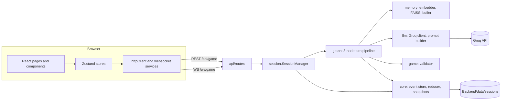

# Architecture

This document describes how the repository is structured: the parts, the module boundaries and the rules that enforce them, how a request flows, where new code goes, and how the system is operated. The frontend design system is in [DESIGN.md](DESIGN.md), and the evaluation results are in the [README](README.md#evaluation-results).

## Context

The repository has three parts:

| Part       | Location                                                                                   | Runs where              | Owns                                                                                                                                 |
| ---------- | ------------------------------------------------------------------------------------------ | ----------------------- | ------------------------------------------------------------------------------------------------------------------------------------ |
| Backend    | `Backend/`                                                                                 | Local Python process    | Session lifecycle, event persistence, deterministic world state, memory retrieval, prompts, LLM calls, validation, WebSocket updates |
| Frontend   | `Frontend/`                                                                                | Browser, served by Vite | Routing, UI state, HTTP calls, WebSocket connection state, and presentation                                                          |
| Evaluation | [`notebooks/npc-memory-state-benchmark.ipynb`](notebooks/npc-memory-state-benchmark.ipynb) | Kaggle, GPU T4 x2       | The benchmark, baselines, independent oracle, and statistics; imports the backend as a library                                       |

The application is a layered modular monolith. One backend process and one static frontend are enough for the current workload: a single-player game with at most `MAX_CONCURRENT_SESSIONS` (50) in-memory sessions. Each layer is a package with one responsibility, so it could be extracted later without rewriting callers.

## Backend module map

| Package      | Responsibility                                                              | May import                        |
| ------------ | --------------------------------------------------------------------------- | --------------------------------- |
| `schemas/`   | Canonical Pydantic models: world state, events, LLM output                  | standard library, Pydantic        |
| `core/`      | Event store, reducer, snapshots. Deterministic, no ML or network            | `schemas`                         |
| `game/`      | World seed loading and validation of proposed world updates                 | `schemas`, `core`                 |
| `memory/`    | Embedder with SQLite cache, FAISS index, short-term buffer                  | `config`                          |
| `llm/`       | Groq client and prompt construction                                         | `schemas`, `memory`, `config`     |
| `graph/`     | One turn: retrieve, prompt, generate, parse, validate, commit, remember     | all of the above                  |
| `session/`   | Session lifecycle, save files on disk, dialogue history, turn orchestration | all of the above                  |
| `api/`       | HTTP and WebSocket transport, API DTOs, presenters, dependencies            | everything                        |
| `config`     | Environment-driven settings, validated at import                            | standard library, `python-dotenv` |
| `log_config` | Log format, request and session context variables, quiet dependencies       | standard library                  |

Inside `api/`:

- `app.py` is the application factory. It owns the `SessionManager` on `app.state`, the middleware, and the exception handler.
- `dependencies.py` resolves the session manager and returns 404 for unknown sessions. Routes never look sessions up themselves.
- `routes/sessions.py`, `routes/gameplay.py`, `routes/world.py`, and `routes/websocket.py` each hold one route group.
- `presenters.py` maps internal state to response DTOs, and `realtime.py` builds and broadcasts WebSocket messages.

Inside `session/`:

- `manager.py` holds `SessionManager`, which creates, loads, saves, and destroys sessions, commits player-driven events, and runs turns.
- `game_session.py` holds the per-session runtime state.
- `save_files.py` is the only place that knows the on-disk save layout.
- `dialogue.py` builds the display dialogue entries.

The lower layers (`schemas`, `core`, `game`, `memory`, `llm`, `graph`) have no web or session dependency. This is what lets the evaluation notebook import them directly, rebuild the turn graph from the same node factories, and swap single nodes for baselines and ablations.

Logging: every module uses `logging.getLogger(__name__)` and passes structured fields with `extra=`. Only `server.py` calls `log_config.configure_logging`. The request middleware in `api/app.py` binds `req`; `api/dependencies.get_session` and the WebSocket route bind `session`; blocking work runs through `asyncio.to_thread`, which carries both into worker threads. Do not use `loop.run_in_executor` for request work; it drops that context.

Dependency rules are enforced by [Backend/tests/test_architecture.py](Backend/tests/test_architecture.py), which fails when a lower layer imports a higher one.

## Frontend module map

| Folder                            | Responsibility                                             | Must not import                            |
| --------------------------------- | ---------------------------------------------------------- | ------------------------------------------ |
| `contracts/`, `types/`, `config/` | Backend DTOs (snake case), UI domain types, constants      | React, stores, services, pages, components |
| `services/`                       | REST client (`httpClient.ts`), WebSocket lifecycle, facade | React, stores, pages, components           |
| `stores/`                         | Zustand state; `mappers.ts` converts DTOs to UI types      | pages, components, hooks                   |
| `hooks/`, `lib/`, `components/`   | Shared hooks, formatting, reusable UI                      | pages                                      |
| `pages/`                          | Route-level composition                                    | (top layer)                                |

Inside `components/`:

- `ui/` holds the custom primitives: `Button`, `IconButton`, `Tooltip`, `Modal` (dialog and side sheet with focus trap), `ChoiceGroup`, `Field`, `Stepper`, `EmptyState`, `SectionLabel` and `ArchFrame` (the arch that frames the emblem on the title and boot screens), and the themed `sonner` toaster.
- `layout/` holds the game shell (`GameLayout`, `GameNavigation`), `BootGate`, and `MasterDetail`, which the Map and People pages share.
- `game/` holds the transcript (`DialoguePanel`), the composer (`PlayerInputDock`), `TrustScale`, `PauseMenu`, and `scene/`, the room panel split into place, people, objects, and player sections.

`hooks/useSavedSessions.ts` fetches the save list, and `hooks/useLocations.ts` fetches every place for the Map page and the Scene panel's exit names. `stores/uiStore.ts` holds the open dialog and who the player is addressing. Design tokens, type, layout, and motion rules are described in [DESIGN.md](DESIGN.md).

These rules are enforced by `no-restricted-imports` blocks in [Frontend/eslint.config.js](Frontend/eslint.config.js).

## Evaluation harness

The notebook treats the backend as a library under test:

1. It clones this repository at a pinned commit, asserts the hash, and puts `Backend/` on `sys.path`.
2. It imports the real schemas, `EventStore`, `apply_event`, `rebuild_state`, snapshots, `validate_and_build_events`, `build_prompt`, `FAISSMemory`, `ShortTermMemory`, `GroqClient.extract_json`, and the node factories from `graph/definition.py`.
3. It builds one LangGraph `StateGraph` per condition from those factories and replaces only the nodes a condition changes (for example, the validate node becomes schema-only for ablation A5).
4. It replaces the Groq call with a client adapter that calls a local vLLM server, and replaces only the storage of `Embedder` with a precomputed table.
5. An independent oracle, which imports nothing from `game/validator.py`, audits every committed transition.

So a backend change that alters a node's signature, the `LLMOutput` schema, or `build_prompt` can break the notebook. When the notebook is rerun against a new commit, update `REPO_COMMIT` in its configuration cell. The run outputs live in [`notebooks/outputs/`](notebooks/outputs/); the README documents every file.

## Where new code goes

- New event type: add it to `schemas/events.py`, validate it in `game/validator.py`, reduce it in `core/reducer.py`, and expose any new shape in `api/schemas.py` and `api/presenters.py`. Add tests. If the event can come from the model, add it to the prompt's allowed list in `llm/prompt_builder.py` and to the notebook's oracle.
- New player-driven state change (like move or pickup): add a route to the matching `api/routes/*.py` group that validates input and calls `SessionManager.commit_event`.
- New route group: add a module under `api/routes/` and include it in `api/routes/__init__.py`.
- New save artefact: extend `session/save_files.py` only.
- New backend DTO: add it to `api/schemas.py` and mirror it in [`Frontend/src/contracts/api.ts`](Frontend/src/contracts/api.ts).
- New frontend workflow: server calls go in `services/`, DTO mapping in `stores/mappers.ts`, state transitions in `stores/`, route composition in `pages/`, and repeated UI in `components/`.
- New prompt input: format it in `llm/prompt_builder.py`. Keep enforcement in code (`game/validator.py`), not only in the prompt.
- New world: write a seed in the `WorldState` schema. The notebook's `data/world_*.json` files are examples of six more worlds in that schema.

## Data flow

A player turn:

1. The UI calls `useGameStore.sendAction`, which posts to `POST /api/game/action/{session_id}`.
2. `routes/gameplay.py` resolves the session through `get_session` and calls `SessionManager.process_action`.
3. Under the session lock, the manager runs the session's turn graph in a worker thread: input, retrieval, prompt, LLM, parse, validate, commit, output. Only the commit node writes state, and only events the validator accepted.
4. The route appends display dialogue (`session/dialogue.py`), broadcasts over WebSocket, auto-saves, and returns `ActionResponse`.
5. The frontend refreshes state and maps DTOs through `stores/mappers.ts`.

Move, clue link, pickup, and drop build an explicit event, and `SessionManager.commit_event` appends, reduces, and auto-saves it. Every state change therefore passes through the event log.

Persistence is per session under `Backend/data/sessions/{session_id}/`: `events.db`, manual and auto snapshots with their dialogue files, and the FAISS index and metadata. The embedding cache is shared in `Backend/data/embed_cache.db`. Loading a save restores the snapshot; see [Known gaps and recommended changes](#known-gaps-and-recommended-changes) for the recovery gap this leaves.

## Decisions

| Decision                                                      | Reason                                                                                                  |
| ------------------------------------------------------------- | ------------------------------------------------------------------------------------------------------- |
| Modular monolith, no service split                            | One user-facing workload with shared in-process ML models; no independent scaling or ownership need yet |
| Session orchestration in `session/`, not `api/`               | Lifecycle and persistence are application logic, not transport; routes stay thin and testable           |
| `SessionManager` on `app.state` plus FastAPI dependencies     | Replaces a module global and ten copies of the "session not found" check                                |
| `GameMetadataResponse` is `schemas.world_state.WorldMetadata` | One schema for seed metadata instead of two identical models                                            |
| Turn nodes built by factories in `graph/definition.py`        | Each node can be reused or swapped on its own, which the evaluation relies on                           |
| Validation and reduction kept in separate pure modules        | The barrier can be measured apart from the reducer (ablation A5), and state can be rebuilt from the log |
| Frontend DTO mapping in `stores/mappers.ts`                   | Pure, testable, and kept out of the store                                                               |
| Single Node launcher ([`scripts/dev.mjs`](scripts/dev.mjs))   | Cross-platform, one entry point, lockfile-hash setup skip, fail-fast ports, crash and Ctrl+C teardown   |
| `black` in `requirements-dev.txt`                             | Keeps a development tool out of the runtime dependencies                                                |
| One logging setup in `log_config.py`, Uvicorn access log off  | One format and one line per request; request and session IDs on every line, including in turn threads   |
| Groq SDK retries off; `GroqClient` retries transient errors   | Two stacked retry loops could make nine calls; auth and bad-request errors fail at once as `LLMError`   |
| `/session` route outside the session-guarded layout           | Load game must work from the title screen, before any session exists                                    |
| `MasterDetail` shared by Map and People                       | The list-and-detail structure has one home instead of a tolerated copy                                  |
| Evaluation in a Kaggle notebook, not in the backend tests     | It needs two GPUs, model downloads, and hours of runtime; unit tests stay fast and offline              |

## Allowed duplication

The clone detector (`jscpd`, run by `npm run check`) fails when duplicated code exceeds 1%. These known exceptions are kept on purpose:

- [`Backend/memory/faiss_index.py`](Backend/memory/faiss_index.py): the `MemoryEntry` constructor and `FAISSMemory.add` share a parameter list. `add` builds the entry, and merging the two would couple the index API to the storage record.
- [`Frontend/src/contracts/api.ts`](Frontend/src/contracts/api.ts) mirrors [`Backend/api/schemas.py`](Backend/api/schemas.py) by hand. The DTOs are a small, stable contract, and code generation would add a build step. Revisit if contract drift becomes a problem.
- Literal expected values in tests.

## Production notes

- Configuration comes from the environment ([`Backend/config.py`](Backend/config.py), [`Backend/.env.example`](Backend/.env.example)).
- Unhandled backend exceptions are logged, and clients get a generic error; `DEBUG_ERRORS=true` exposes details. Expected errors are `HTTPException`s.
- Groq calls have a timeout. Only transient failures (429, 5xx, connection, timeout) are retried with exponential backoff. The LLM health ping runs off the event loop.
- Logs are structured (`LOG_FORMAT=text` or `json`, `LOG_LEVEL`), carry `req` and `session` IDs, and every response returns `X-Request-ID`.
- Player input and LLM output are untrusted, and world mutations must pass `game/validator.py`. The validator's known gaps (currency gains, per-turn spending) are listed in [Known gaps and recommended changes](#known-gaps-and-recommended-changes).
- There is no authentication, authorisation, or rate limiting. Do not expose the backend on an untrusted network as is.

## Operations

- `npm run dev`: first-run setup, then both services. See the README.
- `npm run check`: setup, clone detection, `black --check`, backend tests, and the frontend format check, typecheck, lint, tests, and build.
- `GET /health` reports readiness. `GET /api/game/health` reports active sessions and LLM reachability; it makes a real Groq call, so do not poll it frequently.
- Evaluation: run the notebook on Kaggle (GPU T4 x2, internet on, Save & Run All), then extract `outputs.zip` into [`notebooks/outputs/`](notebooks/outputs/). Never run it locally.

## Known gaps and recommended changes

These were found by the evaluation notebook ([`notebooks/outputs/`](notebooks/outputs/)) or by reviewing the code against its results. None of the recommended changes is implemented yet.

| Gap                                                                    | Evidence                                                                                                                                                              | Recommended change                                                                      |
| ---------------------------------------------------------------------- | --------------------------------------------------------------------------------------------------------------------------------------------------------------------- | --------------------------------------------------------------------------------------- |
| Any currency gain passes validation                                    | 51.9% of unlawful currency proposals accepted, for example `delta: 2000`; currency attack success 19.7% through the barrier                                           | Cap positive deltas per turn, or require a matching trade event                         |
| Spending is checked per proposal, not per turn                         | Code: each negative delta is compared with the balance before the turn, so two spends that each fit can together overspend (the reducer then floors the balance at 0) | Validate against a running balance while iterating proposals                            |
| `load_session` ignores events after the snapshot                       | Backend load path after a crash consistent in 0% of replay sessions, 8 turns lost                                                                                     | Fold `store.load_all()` events with id greater than the snapshot's last event id        |
| `active_npc_id` is not event-sourced                                   | Set in `process_action`; replay cannot restore it, so replay hashes exclude it                                                                                        | Record NPC switches as an event, or accept and document it as session-only state        |
| Rejected changes stay in the dialogue                                  | Desync proxy 18.7% of live turns with the barrier against 3.7% without                                                                                                | Tell the model which proposals were rejected and regenerate, or append a narration line |
| The prompt says trust deltas are -10 to 10; the validator allows +/-20 | `prompt_builder.py` against `validator.py`                                                                                                                            | Use one constant for both                                                               |
| NPC secrets never reach the prompt                                     | `build_prompt` sends personality, knowledge, and state, not `secrets`; the world rule says secrets unlock at trust 60                                                 | Add secrets to the prompt when trust is at least 60, and validate reveals               |
| NPC drops do not check that the NPC holds the object                   | `OBJECT_DROPPED` checks possession only when `dropped_by` is `player`                                                                                                 | Check `owner_id` for NPC drops                                                          |
| The validator checks structure, not plausibility                       | A lawful-sized trust change with no reason in the dialogue passes                                                                                                     | Out of scope for the validator; a candidate for future work                             |

## Growth signals

Revisit this architecture when any of these become true:

- More than one backend process is needed, for load or availability. Sessions, locks, and WebSocket connections live in process memory, so state must move to a shared store (for example Redis) and sessions would need sticky routing.
- LLM turns queue behind each other. Move turn processing to a background worker and stream results over WebSocket. In the evaluation, LLM time per turn rose from about 6.9 s single-stream to about 90 s with 84 concurrent sessions on 2 x T4.
- A second game or world is added. Split `game/` per world and load seeds by id.
- Sessions grow past about 1,000 turns. The FAISS index is pruned to 500 entries at that point, so older memories are lost; consider summarised or hierarchical memory.
- A `api/routes/*.py` module passes about 250 lines, or `SessionManager` gains another responsibility. Split by feature.
- The hand-mirrored DTOs drift. Generate `contracts/api.ts` from the FastAPI OpenAPI schema.
